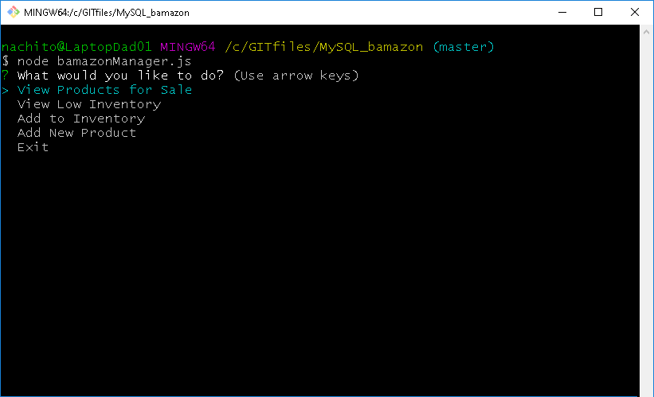

# MySQL_bamazon
> **Cretaed by:**     Juan I Diaz (jdi@idiaz.ca)

> **Date:**           February 2019

## DESCRIPTION
This project is an Amazon-like storefront with the MySQL skills learned at class. The app takes in orders from customers and deplete stock from the store's inventory. As a bonus, you can track the inventory of the store, flaging the low-stocked items, add items or increase

## INSTRUCTIONS
- Before start using this programms you need to create a database into a SQL server. You can use the `bamazon.sql` schema file.

1. To run this project you first need to clone this repository and create a `.env` file with a valid information to connect to the SQL server. The format of the `.env` file should look like this:
   - `SQL_HOST=xxxxxxxx`
   - `SQL_PORT=xxxxxxxx`
   - `SQL_USER=xxxxxxxx`
   - `SQL_PASSWORD=xxxxxxxx`

2. Make sure you install all the NPM packages. To do this run:
   - `npm install`

3. Run the application you want to use:
   - For CUSTOMER experience: To buy items use `node bamazonCustomer.js`.
   - For MANAGER experience: To manage the inventory use `node bamazonManager.js`.

## SCREENSHOTS
`Customer app - main menu`

`Customer app - buying a product`

`Manager app - main menu`

`Manager app - all items table`

`Manager app - low stock items table`

`Manager app - adding stock`

`Manager app - adding an item`

## BUILDING TOOLS
- Javascript and node.js
- NPM packages used:
    - dotenv
    - mysql
    - inquirer

## QUESTIONS, COMMENTS AND CREDITS
- Feel free to contact the developer @ <jdi@idiaz.ca>!